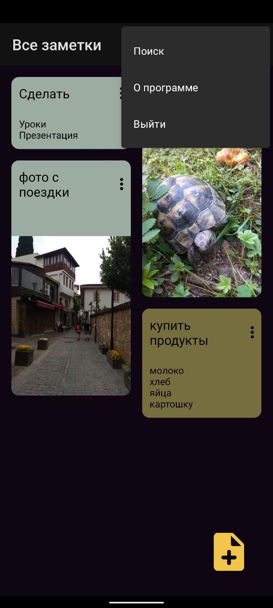
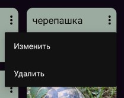
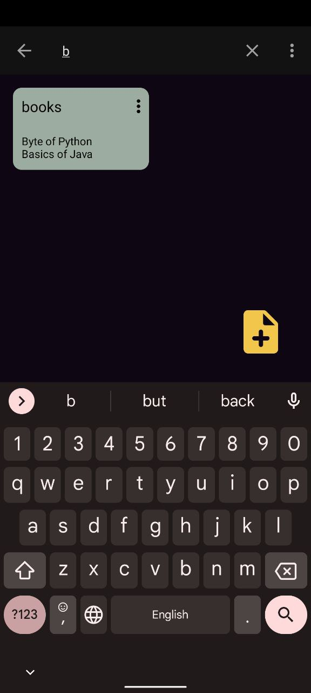

# Android Project SimpleNotes.

Application for android **SimpleNotes**. Source coed in java and xml layout.

The application can create notes with pictures. The application has a complete system of accounts. 

Firebase FireStore + Firebase Storage were used.

> Login page
> 
> 
>
> Register page
> 
> 
>
> Forgot password page
> 
> 
>
> Main page
> 
> 
> 
> Create note page
> 
> 
> 
> Delete note option
> 
> 
> 
> Search option
> 
> 
